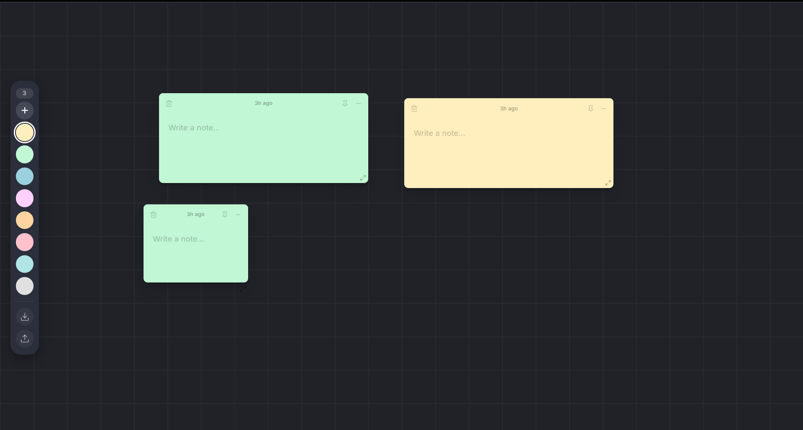

# 📝 Sticky Notes App (React)

A clean, minimal, and responsive **Sticky Notes Web Application** built with **React** that allows users to create, edit, delete, and manage notes efficiently. Designed for speed, usability, and productivity.

---

## 📸 Preview



---

## 🚀 Features

- ✏️ Create notes instantly  
- ⚡ Edit notes in real time  
- 🗑️ Delete notes easily  
- 💾 Persistent storage using LocalStorage  
- 📱 Responsive UI for mobile and desktop  
- 🎯 Lightweight and fast performance  
- 🧩 Modular component architecture  

---

## 📂 Project Structure

```
src/
 ┣ components/
 ┃ ┣ EmptyState.jsx
 ┃ ┣ NoteCard.jsx
 ┃ ┣ SidePalette.jsx
 ┃ ┣ Toast.jsx
 ┃ ┗ side.css
 ┣ icons/
 ┃ ┗ Trash.jsx
 ┣ pages/
 ┃ ┗ NotesPage.jsx
 ┣ utils/
 ┃ ┣ constants.js
 ┃ ┗ utils.js
 ┣ App.jsx
 ┣ main.jsx
 ┗ index.css
```

---

## 🛠️ Tech Stack

- **Frontend:** React.js  
- **State Management:** React Hooks  
- **Styling:** CSS  
- **Storage:** LocalStorage  
- **Linting:** ESLint  

---

## 📦 Installation

```bash
# Clone repository
git clone https://github.com/your-username/sticky-notes-app.git

# Navigate into project
cd sticky-notes-app

# Install dependencies
npm install

# Run development server
npm run dev
```

---

## 💡 Usage

1. Add a new note  
2. Type your content  
3. Edit anytime  
4. Delete when no longer needed  

All notes are automatically saved locally in your browser.

---

## 📜 License

This project is licensed under the **MIT License**.

---

## ⭐ Support

If you like this project, consider giving it a ⭐ on GitHub!